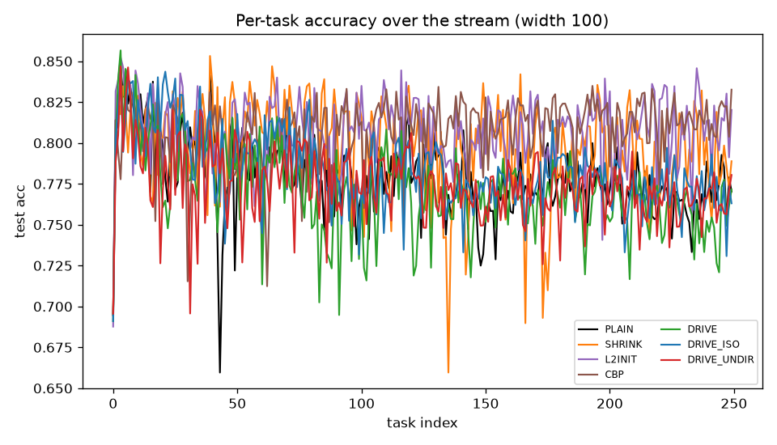
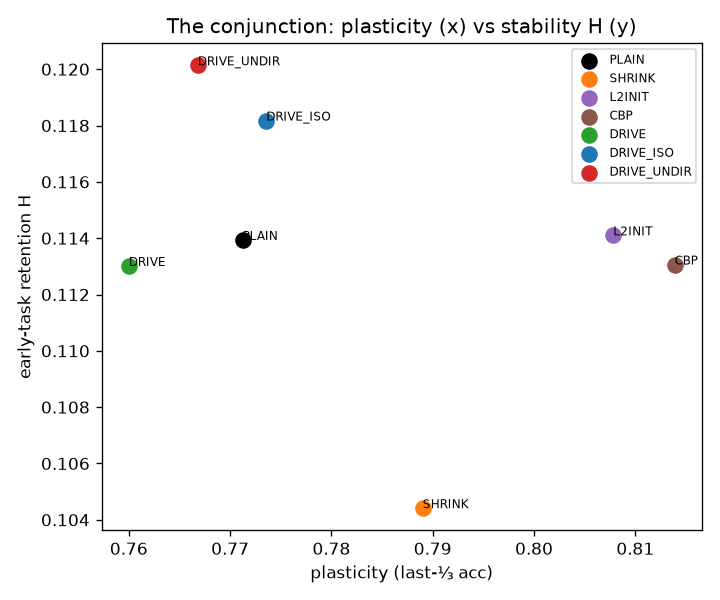
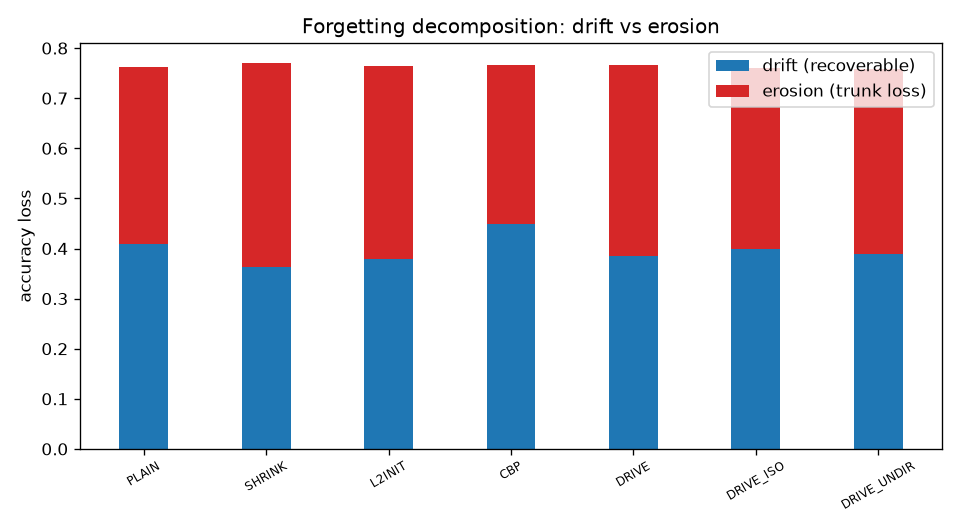
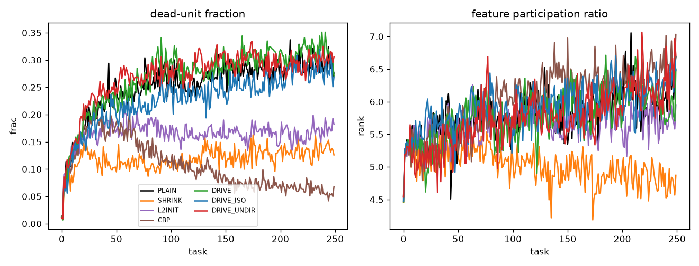
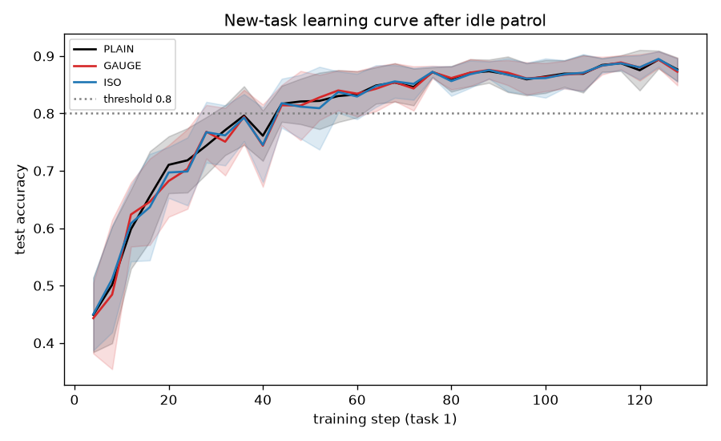
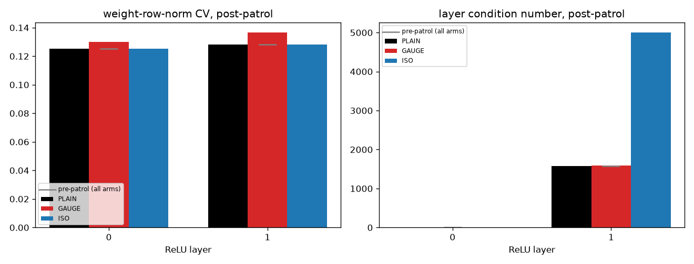
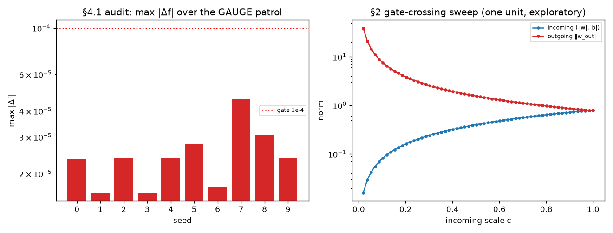

# RESULTS — drive-plasticity (does the drive pay rent?)

Benchmark: **Permuted-MNIST** (real MNIST, raw IDX). Widths [100, 256], seeds [0, 1, 2, 3, 4], 250 tasks, depth 2. Runtime 1398s (23.3 min) CPU.

**Scope deviations (documented, §7.1):** (1) Reduced from the pre-registered 200 tasks / 2000-task literature regime to 250 tasks and 5 seeds — the full grid (7 arms × 5 seeds × 2 widths × HVP-every-step over 200 tasks) is many CPU-hours; this environment is CPU-only. (2) The curvature basis is amortized (recomputed every 25 steps, warm-started) rather than every step, to make the drive affordable. Both weaken the power of the test, not its logic; the kill-criteria bands (§6) are applied as locked.

## Kill-criteria verdict (reported first, §6)

> **The generalized drive does not pay rent — with a documented caveat.**
>
> **(1) The plasticity-maintenance test is under-powered here.** PLAIN first-third plasticity 0.792 → last-third 0.771 (drop +0.021, just under the 0.03 P-disease gate). At 250 tasks on a small MLP the plasticity-LOSS regime is only weakly reached (the literature uses ~thousands of tasks). So the strict P-drive-plast claim is formally not-testable — 'no disease, no test'.
>
> **(2) But the decisive negatives are disease-independent and all fire:** (a) DRIVE is the **worst** plasticity arm (0.760 < PLAIN 0.771; best = CBP 0.814) — to pay rent it must at least MATCH baselines; it mildly HURTS. (b) **K-baseline-wins:** CBP/L2-init dominate on plasticity. (c) No stability benefit: H 0.113 ≈ all arms; erosion +0.380 not below baselines. (d) **Confinement is vacuous:** leak 0.007 — the committed subspace is 5 of ~10⁵ params, so 'confined to flat' is nearly automatic and adds nothing. (e) Ablations inert: DRIVE erosion ≥ DRIVE-ISO (+0.362) and DRIVE-UNDIR (+0.369).
>
> **The narrower, honest conclusion (spec §1):** the payoff required the rare TYPED topological setting (v6, protected structure genuinely low-dimensional). The high-D generalization loses that leverage — good optimizers already vacate the flat directions, and in high-D nearly ALL directions are flat, so actively circulating them buys nothing over doing nothing. The theoretical/topological results stand on their own as a separate, smaller contribution.

## Conjunction table (width 100, 5 seeds)

| arm | plasticity (last⅓) | plasticity (first⅓) | stability H | probe P | erosion | drift | leak | wall/s |
|---|---|---|---|---|---|---|---|---|
| PLAIN | 0.771±0.007 | 0.792 | 0.114 | 0.524 | +0.353 | +0.410 | 0.00 | 6 |
| SHRINK | 0.789±0.011 | 0.808 | 0.104 | 0.467 | +0.409 | +0.362 | 0.00 | 15 |
| L2INIT | 0.808±0.004 | 0.808 | 0.114 | 0.493 | +0.385 | +0.379 | 0.00 | 7 |
| CBP | 0.814±0.004 | 0.799 | 0.113 | 0.562 | +0.317 | +0.448 | 0.00 | 7 |
| DRIVE | 0.760±0.011 | 0.790 | 0.113 | 0.499 | +0.380 | +0.386 | 0.01 | 15 |
| DRIVE_ISO | 0.774±0.009 | 0.802 | 0.118 | 0.516 | +0.362 | +0.398 | 0.01 | 15 |
| DRIVE_UNDIR | 0.767±0.014 | 0.783 | 0.120 | 0.510 | +0.369 | +0.390 | 0.01 | 23 |

## Probe diagnostic window (§9.2)

- Mean upper anchor P_i(t_i) = 0.878, reservoir P_rand = 0.704 → window = 0.174. DIAGNOSTIC (>=0.05): erosion/drift decomposition is used.

## Ablations, mediators, theory bridge

- **Confinement (DRIVE vs DRIVE-ISO):** erosion +0.380 vs +0.362 → confinement does NOT clearly help.

- **Direction (DRIVE vs DRIVE-UNDIR):** erosion +0.380 vs +0.369 → direction does NOT clearly help.

- **Leakage into S_hi (drive):** 0.007 of drive motion lands in the committed subspace despite projection (finite-HVP basis error). Leakage↔erosion correlation over seeds r=-0.52 (§9.5: if strong, the residual forgetting is the price of dropping the exact law).

## Width scaling (§7 — basis error grows with width)

| width | DRIVE plast | DRIVE H | DRIVE erosion | DRIVE leak |
|---|---|---|---|---|
| 100 | 0.760 | 0.113 | +0.380 | 0.01 |
| 256 | 0.824 | 0.118 | +0.265 | 0.00 |

## What is kept vs dropped from the topological drive

KEPT: directed (rotating d in a fixed flat 2-plane), confined to the low-curvature subspace, structure-preserving (D⊥g). DROPPED: the exact integer conservation law — here confinement is enforced only to the finite-HVP top-k basis, and leakage (0.01) is the measured cost of that approximation. If the drive fails here but the exact topological version succeeds (v6), the payoff needs the rare typed setting — the narrower, honest conclusion.

## Figures

*Per-task test accuracy over the stream, per arm.*

*Plasticity vs stability (the conjunction) per arm.*

*Drift vs erosion decomposition of forgetting per arm.*

*Dead-unit fraction and feature rank over the stream.*

<!-- VALLEY1 SECTION -->

# valley-1 — the gauge-orbit drive (exact-symmetry circulation)

Model: MLP width 64 depth 2. Permuted-MNIST, 2000/2000 train/test per task. Seeds [0, 1, 2, 3, 4, 5, 6, 7, 8, 9]. Idle patrol K=200 steps (1/4 of the 800-step Lissajous period, amp=0.3) -- stops a quarter of the way around the closed loop, parked away from theta*, not returned to it. New-task budget = 8 epochs. Threshold acc=0.8. Runtime 6s.

## §4.1 — exact invariance audit (validated invariant, NOT a finding)

> Max |f_θ(t)(x) − f_θ(0)(x)| over the GAUGE patrol, across all seeds and all 200 steps: **4.58e-05** (gate: < 1e-4). PASSES — the rescaling is exact, as it must be by construction.

## Kill-criteria verdict (§4.2, reported first)

> **❌ K-noteeth.** Steps-to-threshold (acc≥0.8) on the new task: PLAIN 36.0, GAUGE 34.4 (+4.4% vs PLAIN, need ≥15% fewer), ISO 32.0. Final test loss: GAUGE 0.411 vs ISO 0.404 (GAUGE must be lower).

> 
> **K-noteeth — a clean, important negative.** GAUGE ≈ PLAIN on both speed and final loss: where you sit on the gauge orbit has NO measurable operational consequence, despite the orbit being real, exact, and analytically known (no estimation error, unlike exp7's vacuous curvature subspace). The frozen minimum θ* is arbitrary in a representational sense (Git Re-Basin) but that arbitrariness carries no plasticity cash value on this axis. This does NOT touch valley-2's topological claim (identity, not plasticity).

## Steps-to-threshold, final loss/acc, by arm

| arm | steps-to-thr (mean±sd) | reached within budget | final loss | final acc | first-task-1 grad norm | ‖θ − θ*‖ post-patrol |
|---|---|---|---|---|---|---|
| PLAIN | 36.0±4.7 | 100% | 0.402±0.064 | 0.877 | 2.43±0.37 | 0.000±0.000 |
| GAUGE | 34.4±7.8 | 100% | 0.411±0.072 | 0.873 | 2.43±0.37 | 0.377±0.009 |
| ISO | 32.0±7.6 | 100% | 0.404±0.060 | 0.875 | 2.43±0.37 | 0.030±0.001 |

- Note (§3): displacement is matched PER-STEP, not cumulatively — GAUGE's directed, coherent motion covers ~13x more raw parameter distance than ISO's random walk over the same K steps at the same per-step budget (ballistic vs diffusive net displacement, the same asymmetry as the topological drive's circulation-rate advantage elsewhere in this program). GAUGE nonetheless does not convert that larger reach into a plasticity advantage here (see verdict above).

## Old-task retention after patrol (corollary — not a P-G1 clause)

- Task-0 **accuracy** right after training (θ*): 0.723. After the idle patrol: PLAIN 0.723, GAUGE 0.7229 (bit-identical to PLAIN, every seed — must equal θ*'s accuracy exactly, same function, by §4.1), ISO 0.7229 (also indistinguishable from PLAIN at this precision — the discrete argmax accuracy metric on 2000 examples is too coarse to register a ~0.03-norm parameter perturbation against confident, well-separated decisions).
- The continuous **test loss** confirms GAUGE matches PLAIN to numerical precision in every seed (mean diff -1.31e-07 — must be exactly 0 up to float error, §4.1 guarantees identical logits). ISO's loss differs from PLAIN by a mean signed -3.82e-05 (mean absolute 1.33e-04, 4/10 seeds higher) — a real but tiny, NON-systematic perturbation at this displacement scale, not a directional 'erosion cost'; too small to read as a stability advantage for GAUGE on this axis.

## §4.3 mediators — weight-norm balance and layer conditioning

| arm | layer | CV pre | CV post | cond pre | cond post |
|---|---|---|---|---|---|
| PLAIN | 0 | 0.125 | 0.125 | 3.9 | 3.9 |
| PLAIN | 1 | 0.128 | 0.128 | 1579.6 | 1579.6 |
| GAUGE | 0 | 0.125 | 0.130 | 3.9 | 3.9 |
| GAUGE | 1 | 0.128 | 0.137 | 1579.6 | 1583.9 |
| ISO | 0 | 0.125 | 0.125 | 3.9 | 3.9 |
| ISO | 1 | 0.128 | 0.128 | 1579.6 | 5005.3 |

- Caveat: the layer-1 condition-number MEAN is driven by a single outlier seed (seed 8: PLAIN 11371 → ISO 45640, an already near-singular layer pushed further by isotropic noise); across the other seeds GAUGE/ISO/PLAIN post-patrol conditioning is comparable. No robust general 'GAUGE preserves conditioning better' pattern should be read into the mean row above.

## §2 — the parameter-space gate (exploratory bridge, not part of P-G1)

- Driving one unit's incoming scale c: 1.00 → 0.02 while holding the function fixed: incoming norm 0.804 → 0.016, outgoing norm 0.780 → 38.981 (diverges as c→0, exactly the f=0 gate structure one level down — see figure). Not attempted in the primary bounded patrol; demonstrated on request only.

## §4.1/§4.2 by-construction vs actually-tested

| result | by-construction? | actually tests |
|---|---|---|
| GAUGE patrol leaves f_θ(x) exactly unchanged | **YES** (ReLU positive homogeneity) | implementation correctness only |
| gauge orbit closes after one period (θ returns exactly) | **YES** (Lissajous s(period)=s(0)=0) | — |
| GAUGE reaches new-task threshold faster than PLAIN/ISO | no | **P-G1**, the actual claim |
| mediator shifts (weight-norm balance, conditioning) explain the outcome | no | exploratory, §4.3 |

## Figures

*New-task learning curves (test accuracy vs step), mean over seeds.*

*Weight-norm CV and layer condition number, pre/post patrol, by arm.*

*Left: §4.1 invariance audit trace (GAUGE). Right: §2 gate-crossing sweep.*

