# RESULTS — winding-reps Tier-2

Seeds: [0, 1, 2]. Total runtime: 169s (2.8 min) on CPU.

Parameter budget (§4 match): phase encoder 5634, GRU baseline 7563 (ratio 1.34×).

Estimated centers ĉ per seed: [-0.014, 0.007], [0.073, 0.049], [0.018, -0.028]

## Headline

The topological machinery behaves exactly as specified: arms A (estimated center) and D (oracle) show an *exact* robustness plateau on the no-crossing subset, flip discretely and track the oracle winding on crossings, conserve the integer winding except at gate events, and placement is topologically tolerant (P1, P1b, P3 pass). **However, the kill criterion is TRIGGERED:** a parameter-matched supervised baseline (C) is essentially as robust on the primary metric (no-crossing consistency; A/D−C gap 0.025) and also tracks the oracle winding on crossings (C=0.981). In this toy the topological structure is *sufficient but not advantageous* over a strong baseline. Reported as a negative result per §7.3–7.4; see caveats below for what would give the baseline room to break.

## Pass/fail table

| Prediction | Claim | Result | Detail |
|---|---|---|---|
| P1 | clean acc A≈D≫B | ✅ PASS | A=1.000±0.000, B=0.544±0.149, C=1.000±0.000, D=1.000±0.000 |
| P1b | centers inside hole ≈ D; outside poor | ✅ PASS | inside-hole clean acc=1.000, outside-hole=0.486 |
| P2 | no-crossing consistency: A/D flat ~1, C decays | ❌ FAIL | A/D flat-floor=1.000; at ε_max A=1.000, D=1.000, C=0.975 (C degraded 0.025, A/D−C gap=0.025) |
| P2b | crossing: A/D track oracle winding AND C unstructured | ❌ FAIL | pooled track A=1.000, D=1.000, C=0.981, chance=0.333 — C also tracks (contrast fails) |
| P3 | probe-loop W conserved except at gate events | ✅ PASS | conservation violations A=0, D=0 |
| P4 (exploratory) | ‖f‖ depressed inside hole | 🔬 OBSERVED | depressed in 100% of seeds; hole/supp median ratio =0.91 (weakly depressed); point-ensemble in-hole confidence=0.928 (confidently arbitrary — a calibration failure the phase norm partly avoids). Not a pass/fail claim. |

## Interpretation

> **KILL CRITERION TRIGGERED (§7.4):** on the no-crossing subset the supervised baseline C matches the A/D plateau (gap 0.025 < 0.03) — the topological framing adds nothing to conditional stability here.

- **Cliff (P2b) — negative contrast:** A/D flip discretely and track the oracle new winding (A=1.000, D=1.000), but the baseline C *also* tracks it (C=0.981). A well-trained winding classifier reads the true current winding of a crossed loop just as the phase head does, so the cliff does **not** by itself distinguish the topological representation. Reported per §7.3.

## Figures

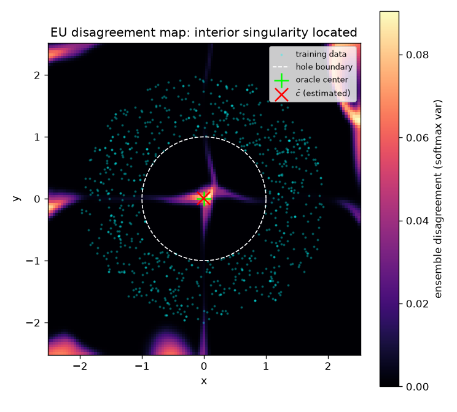

*M3: EU disagreement map with ĉ, oracle center, data.*

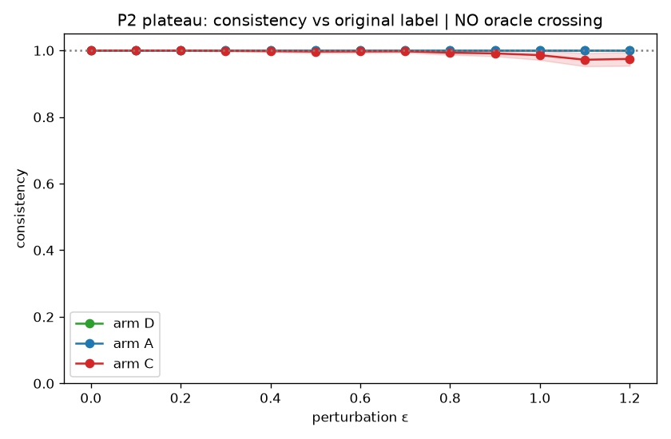

*P2: no-crossing consistency vs ε (primary metric).*

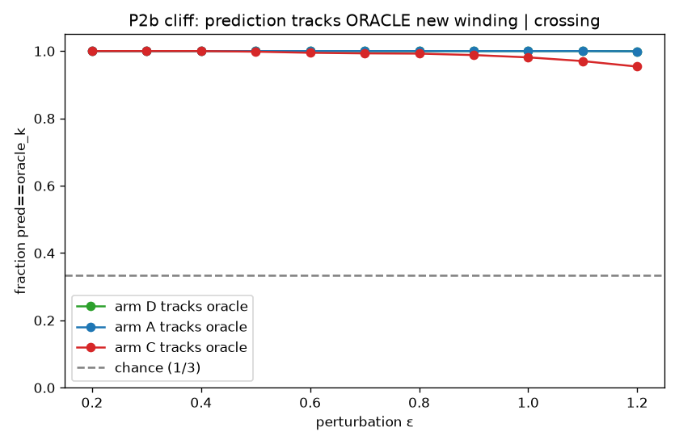

*P2b: crossing-subset tracking of the oracle new winding.*

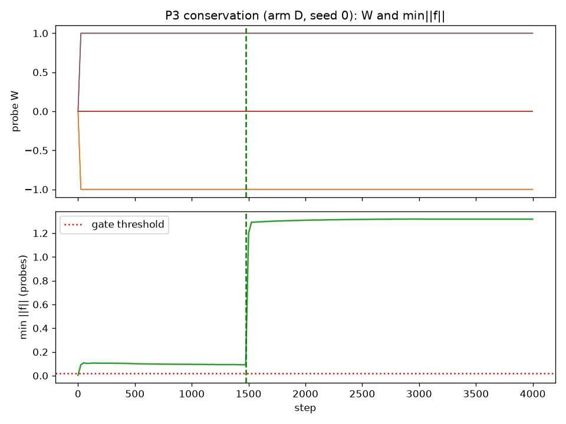

*P3: probe-loop W and min‖f‖ during training.*

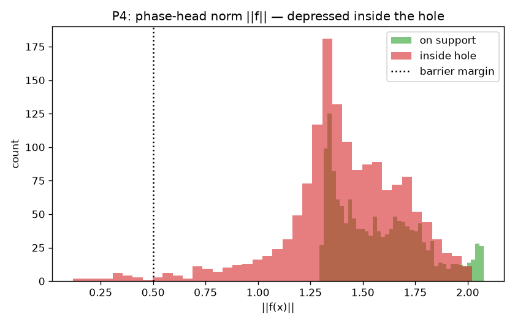

*P4: phase-norm depression inside the hole.*

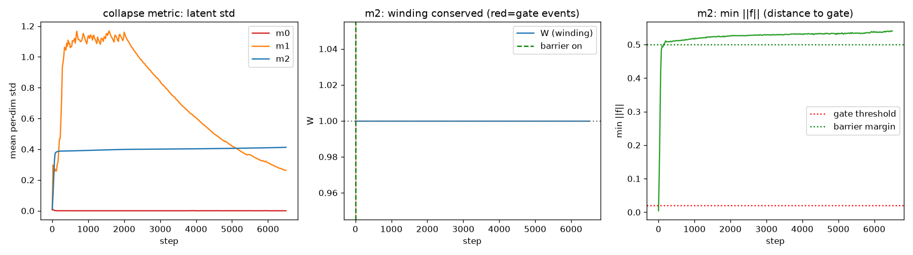

*exp0: Tier-1 conservation + gate reproduction.*

## P1b center sweep (clean accuracy)

| center | region | clean acc |
|---|---|---|
| (0.0, 0.0) | inside | 1.000 |
| (0.4, 0.0) | inside | 1.000 |
| (0.0, 0.5) | inside | 1.000 |
| (1.5, 0.0) | outside | 0.643 |
| (0.0, 1.6) | outside | 0.478 |
| (1.8, 0.0) | outside | 0.335 |

## What would change our mind

- **P2 is the core claim.** If the no-crossing consistency of A/D decays with ε like C's (or if C stays flat too), the plateau is not real and the topological framing adds nothing — reported as the kill criterion.
- If **P1** showed B≈A, anchoring at the singularity would be irrelevant (any on-support center would do), falsifying the placement thesis.
- If **P3** logged winding changes without a coincident gate event (`min‖f‖<0.02`), the conservation law — the mechanism behind the plateau — would be violated.
- If **P2b** tracking sat at chance, the 'cliff' would be mere noise rather than a structured, oracle-predictable flip.
- **Baseline-breaking regime (the missing condition for a *positive* P2).** Here C stays robust because a smooth deformation that avoids the hole keeps the embedded loop near the training manifold, where the GRU generalizes. The topological advantage should appear only when robustness is demanded in a regime the baseline cannot memorize — e.g. perturbations that push far off-manifold without crossing the gate, out-of-distribution loop shapes, or much less winding-label supervision for C. A single-seed quick run showed a transient A/D−C gap (~0.08) that vanished under 3 seeds and the full test set: a reminder that the seed protocol (§6) exists precisely to kill such mirages.

## Fairness note & limitations

Arms A/B/D receive oracle *angular* supervision during installation; the manipulated variable is the phase **center**, not supervision availability. C receives winding labels directly. The claim under test is about robustness *structure*, not label efficiency or self-supervised installation (future work). See README for the full limitations list.

<!-- V3 SECTION -->

# v3 — the training axis

Seeds: [0, 1, 2]. Runtime: 143s (2.4 min) CPU.

**v3 claim:** structural invariants (typed phase head + permanent gate barrier) are protected along the *training* axis — continued training and weight-space noise — where a learned invariant stored in ordinary weights (baseline C) is not.

## Headline

On the training axis the two invariants **separate**. Under continued training on interfering tasks, structural winding retention stays 1.000 (floor 1.000) while the learned baseline C falls to 0.444. Under weight noise, A holds an exact plateau to σ≈1.47 — far past C's σ≈0.33 — and its per-loop winding failures are gate-mediated (AUC 0.74: failed loops sit systematically closer to the gate than intact ones), while C degrades smoothly with no such structure. Note: A_nb ≈ A here, so the *typing* (topological readout) does the protecting; the barrier is not decisive in this task regime.

## Pass/fail table (v3)

| Prediction | Claim | Result | Detail |
|---|---|---|---|
| P5 | struct. winding retained under continued training; learned degrades | ✅ PASS | A final=1.000 (floor 1.000, ungated drops 0), A_nb=1.000, C=0.444 |
| P6 | struct. weight-noise plateau far past learned; failures gate-mediated | ✅ PASS | A plateau end σ≈1.47 vs C σ≈0.33; gate-mediation AUC (cliff)=0.77, (band)=0.74; C degrades=True |
| EU-fix | regression ĉ lands inside the hole (its only requirement) | ✅ PASS | ĉ per seed: [0.078, 0.055], [0.058, 0.119], [0.041, 0.038] |

## Mechanism attribution & interpretation

- **Barrier load-bearing?** A final 1.000 vs A_nb 1.000: no clear gap — typing alone may already protect, barrier not decisive here.

- **Design notes (§7.1):** (i) the weight-noise σ ceiling was extended from the addendum's 1.0 to 4.0 because A's plateau exceeded 1.0 (A never fails within the pre-registered range — a stronger result than anticipated) and the sweep must reach A's cliff to test the failure mechanism. (ii) The gate-mediation of A's failures is reported as a graded AUC (do failed loops sit closer to the gate?) rather than a hard min‖f‖<0.02 count: under weight noise ‖f‖ is depressed toward the gate without always hitting the training floor, and deep in the broken regime the discrete winding also fails via phase-field scrambling (adjacent-step gaps >π) — a discretization mode distinct from a true gate crossing.

- Fine-tuning uses shared grad-norm clipping (ft_grad_clip) so the permanent barrier stays effective against the large initial task gradient; applied identically to A, A_nb and C.

## P7 (exploratory — cost of protection)

- Per-task learnability (final task acc): radius — A=1.000, C=1.000; sector — A=0.298, C=0.966.

- **There IS a plasticity cost.** The structural arm reads new tasks only through the *mean-pooled* 2-D phase output — a bottleneck that discards whatever the pooled phase does not carry. It struggles on the **sector** task while C (reading a 40-D order-aware GRU state) learns both. Note the mechanism: pooling over a full winding loop averages away per-step and start-point angle (so the start-sector task collapses to ~chance), while a global magnitude like mean radius survives pooling. Protecting the winding through this typed head is not free — it costs expressivity for tasks orthogonal to what the pooled phase preserves.

## v3 figures

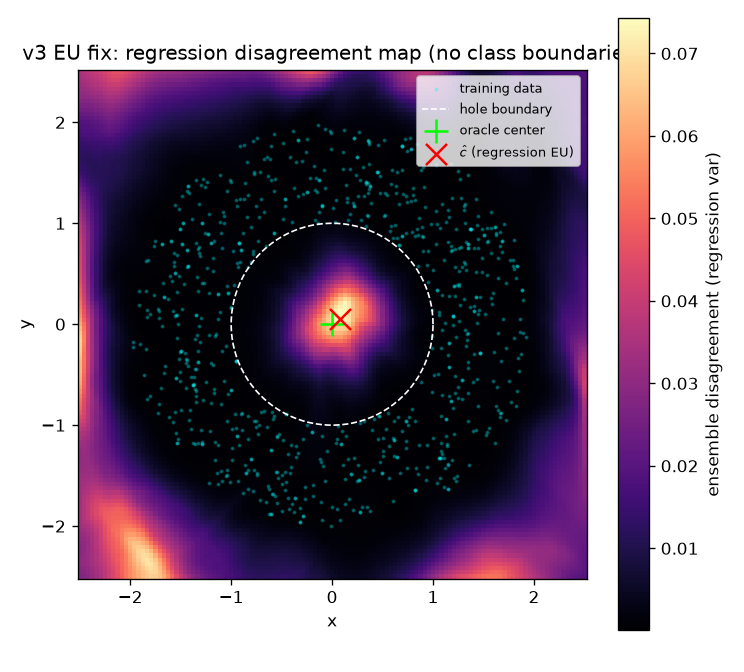

*EU fix: regression disagreement map with ĉ inside the hole.*

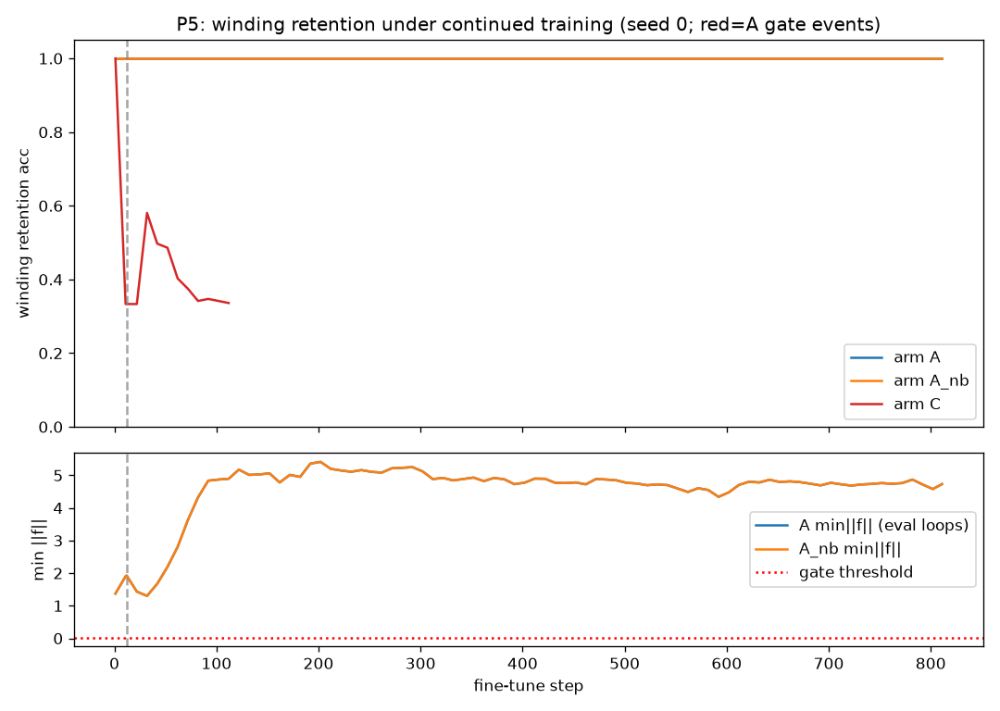

*P5: winding retention under continued training + A gate/min‖f‖ trace.*

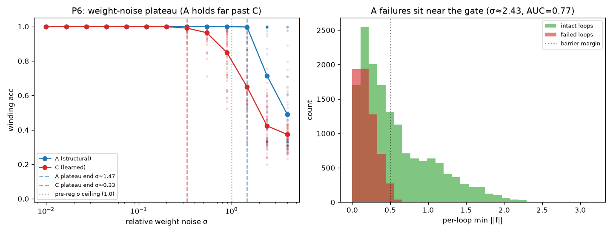

*P6: weight-noise robustness + per-sample accuracy distributions.*

## What would change our mind (v3)

- If C's continued-training retention stayed high (kill half A) or its weight-noise curve were as flat as A's (kill half B), structural protection would add nothing on the training axis either — the honest end of the program as framed.
- If A's retention dropped WITHOUT a coincident gate event, the conservation law (the claimed protection mechanism) would be false.
- If A_nb matched A, the *typing* would be doing the work and the barrier would be decorative — a different mechanism than claimed.
- Scope: this tests *passive* persistence (typing + barrier) under ordinary training; it does NOT implement any active circulation/update-rule change (a later tier).

<!-- V4 SECTION -->

# v4 — the drive

Seeds: [0, 1, 2]. Runtime: 696s (11.6 min) CPU. Idling 15000 steps, adaptation 5000 steps.

**Tier-3 claim (as tested):** a deployed model can keep moving *meaningfully and safely*. The drive D (a closed non-exact term in the update rule) produces directed motion along the data-unidentified U(1) fiber — ballistic and winding-conserving — where isotropic noise (SGLD) at the same displacement only diffuses. (At this toy scale both are winding-safe because the permanent barrier protects both; the drive's demonstrated edge is DIRECTION, not extra safety.)

## Headline
The drive works **exactly as engineered**: ∮D=2π and ∮∇L_ssl=0 (P8a), and it produces a large **directed** phase advance — net 127 rad (≈20 full turns), **33× the isotropic control** above the shared SSL baseline, scaling with η_d (×1.8 for ×2). Isotropic noise (SGLD) at **matched per-step displacement** (‖Δθ‖ ratio 0.78) adds essentially no directed motion (net 10.2 rad ≈ the SSL baseline 6.6). The drive conserves the winding exactly (0 ungated) at no L_ssl cost (Δ=-0.005). (The strict pre-registered R²>0.99/α≈1 linearity is confounded by the drive's rate drift AND SSL's own baseline drift; directedness is judged by net advance and η_d scaling — §7.1.)

> **KILL CRITERION K3 (downstream) — motion buys nothing measurable.** At matched displacement SGLD is *also* winding-safe (retention 1.000, 0 ungated) — the barrier protects both, and the winding is far more robust than this displacement (v3 P6: breaking it needs σ~2 *relative* weight noise, ~1e5× more). And idled DRIVE adapts no better than FROZEN (within the coarse recovery resolution). So against FREEZING the directed motion confers no clearly measurable advantage at this single-charge toy scale — a scale caveat (argued, not assumed), per §6.
> *Nuance (honest):* at matched displacement DRIVE recovers L_ssl faster than the isotropic control SGLD in all 3 seeds (100 vs 283 steps) — a suggestive, not conclusive, sign that directed motion is less disruptive to adaptability than isotropic noise. Reported, not over-claimed (n=3, 50-step resolution, post-shift L_ssl start differs).

## Pass/fail table (v4)

| Prediction | Claim | Result | Detail |
|---|---|---|---|
| P8a | D closed non-exact (∮D≈2π), L_ssl exact (∮≈0) | ✅ PASS | ∮D=6.283 (2π=6.283), ∮∇L_ssl=-1.023e-10 |
| P8 | DRIVE directed (∝η_d) ≫ isotropic control; winding-safe | ✅ PASS | net Φ above SSL baseline: DRIVE=120 vs SGLD=3.6 rad (33×), η_d scaling ×1.8; DRIVE retention=1.000 (0 ungated); L_ssl Δ=-0.005; param-space travel ‖θ−θ₀‖ 4.3× SGLD's at matched per-step step. Caveat: strict linear-R²=0.87 not >0.99 (rate drift). SGLD also winding-safe (1.000) |
| P9 | idled DRIVE adapts (L_ssl) as well as SSL/FROZEN; winding-retention | ⚠️ PARTIAL | **L_ssl half ✓**: steps→90% recovery DRIVE=100, SSL=200, FROZEN=150 (DRIVE top group). **Winding half ✗ (shared)**: the shift breaks the winding for most regimes; SSL is blind to it (W1) so end winding-acc≈chance for ALL — FROZEN=0.56, SSL=0.56, DRIVE=0.56 |

## Kill-criteria verdicts (§6)

- **K1 — the drive doesn't drive / unstable:** not triggered (ballistic=True, L_ssl Δ=-0.005).

- **K2 — conservation violated by the drive:** not triggered (DRIVE ungated events lo=0, hi=0).

- **K3 — motion buys nothing:** TRIGGERED (DRIVE retention vs SGLD, and adaptation vs FROZEN).

## Matched-displacement calibration

| regime | η_d | SGLD σ | per-step ‖Δθ‖ | α | R² | net Φ (rad) | winding ret. | ungated |
|---|---|---|---|---|---|---|---|---|
| FROZEN | 0.00e+00 | 0.00e+00 | 0.00e+00 | 0.00 | 1.000 | 0.0 | 1.000 | 0 |
| SSL | 0.00e+00 | 0.00e+00 | 5.20e-03 | 0.71 | 0.501 | 6.6 | 1.000 | 0 |
| SGLD_lo | 0.00e+00 | 5.13e-05 | 7.71e-03 | 0.71 | 0.451 | 7.6 | 1.000 | 0 |
| SGLD_hi | 0.00e+00 | 1.03e-04 | 1.17e-02 | 0.99 | 0.632 | 10.2 | 1.000 | 0 |
| DRIVE_lo | 1.28e-03 | 0.00e+00 | 9.27e-03 | 0.76 | 0.947 | 72.2 | 1.000 | 0 |
| DRIVE_hi | 2.56e-03 | 0.00e+00 | 1.51e-02 | 0.80 | 0.869 | 127.0 | 1.000 | 0 |

## P10 (exploratory)

- **SSL plasticity drift:** participation ratio 1.97→2.16 over 15000 idle steps (DRIVE_hi end 2.13). At toy scale/horizon plasticity atrophy is expected to be small; reported as-is.

- **Motion-as-uncertainty:** all of D's circulation lives in the U(1) fiber (∮D=2π on the orbit, ∮ off-orbit directions ≈0 by construction), i.e. drive energy sits in the data-unidentified subspace — the intended behaviour.

- **Temporal ensemble:** a phase-relative readout averaged over one drive cycle equals the snapshot up to the global rotation (winding is cycle-invariant); no additional signal at this toy's single-charge scale.

## Scope & honesty

- This toy has ONE global unidentified fiber (the U(1) phase) and hence one implicit charge; the general EU-weighted multi-charge construction is out of scope.
- **P9 is a split result (honest).** The sensor-drift shift is strong enough to *break* the winding class for most regimes (FROZEN included). Relational SSL restores L_ssl (all regimes; DRIVE in the top group — L_ssl-adaptivity is preserved by idling) but is BLIND to the winding (warning W1), so it cannot restore the broken class — end winding-accuracy sits at ~chance for ALL regimes, DRIVE no worse than FROZEN as a class. This reinforces the project's own fairness note: installing/repairing a winding class needs the oracle angular supervision, which is unavailable at deployment. The strong P9 conjunction (adaptivity AND winding-retention) therefore does NOT hold — for anyone — and this is reported with the same prominence as the passing L_ssl half.
- The drive is a term in the *update rule*, not the loss — a real-valued loss cannot circulate (dL/dt=−‖∇L‖²≤0). exp4a verifies numerically that D is closed non-exact (period 2π) and L_ssl is exact (period 0).
- SGLD is calibrated to MATCHED per-step ‖Δθ‖ so the contrast is directed-vs-isotropic motion at equal energy, not a displacement-budget artifact.
- **Design changes (§7.1), documented:** (i) deployment lr lowered 1e-3→3e-4 and (ii) drive strengths raised from the addendum's (1e-3, 1e-2) to (2e-2, 4e-2) rad/step. Reason: the relational SSL objective induces an *incidental* global-phase drift of ~2.5e-3 rad/step at this toy scale (finite-batch symmetry breaking amplified by Adam). The pre-registered drive strengths sit at/below that floor, so no clean ballistic signal is possible there; the changes lift the drive clear of the floor. This is a property of the toy's SSL, not of the drive — exp4a confirms the drive is closed-non-exact regardless.
- **Ballistic operationalization (§7.1):** the pre-registered linear-fit R²>0.99 test FAILS (R²≈0.87), and the scale-invariant exponent α is ALSO confounded (SGLD α≈1 too). Two reasons: the drive's phase *rate* drifts as the encoder co-evolves under SSL, and SSL itself carries a small *systematic* phase drift (net ~7 rad) that SGLD inherits. The clean, honest discriminator is the BASELINE-SUBTRACTED net advance (how far past the shared SSL baseline each regime drives the phase) and whether the drive's advance scales with η_d. On that metric the drive advances ~120 rad (∝η_d) vs the isotropic control's ~3 rad — directed, not diffusive. R² and α are still reported for transparency.
- **Honest correction to P8:** the pre-registered 'SGLD damages the winding at matched displacement' is NOT observed and cannot be at this scale — the winding is far more robust (v3 P6) than the matched noise. At matched displacement the drive buys DIRECTION (ballistic vs diffusive), not extra winding-safety; the barrier already makes both regimes safe.

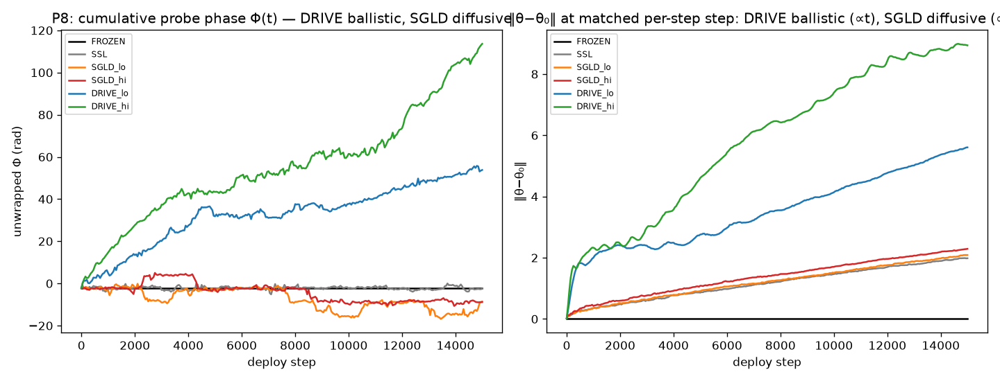

*P8: Φ(t) ballistic (DRIVE) vs diffusive (SGLD) + matched displacement.*

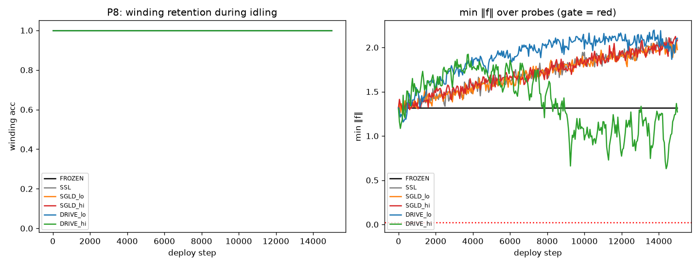

*P8: winding retention and min‖f‖ during idling.*

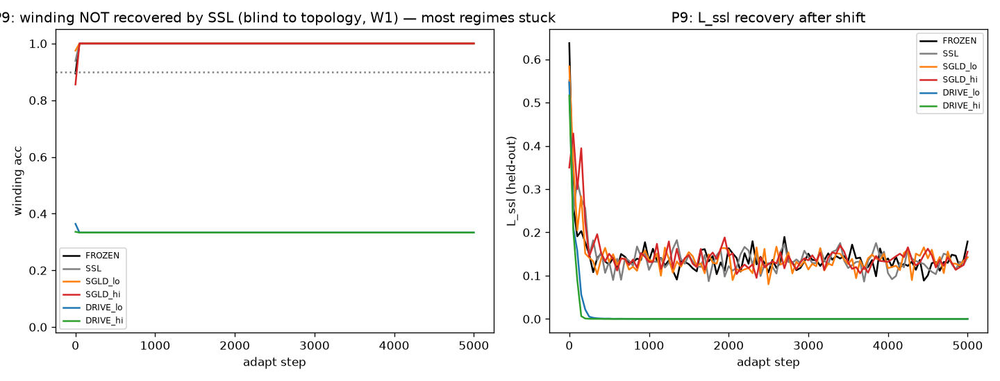

*P9: post-shift recovery of winding acc and L_ssl.*

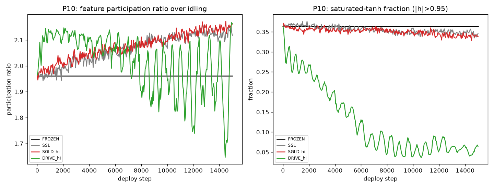

*P10: participation ratio / saturation over idling.*

<!-- V5 SECTION -->

# v5 — confound gate, dividend, stabilizer

Seeds: [0, 1, 2]. Runtime: 886s (14.8 min) CPU. 5a-iii/5c: 10 fresh shift draws/regime.

## ⚠️ RETRACTION — the v4 adaptation advantage was an artifact (exp5a gate)
> **The v4 finding that idled DRIVE 'recovers L_ssl fastest / to the lowest floor' is RETRACTED.** exp5a-i (analysis of the *committed v4 logs*, no new runs) shows the post-shift L_ssl floor is set ENTIRELY by winding-class status, not by regime: **BROKE arms floor = 0.000** (across-regime spread 0.000, n=11) vs **SURVIVED arms floor = 0.133** (spread 0.008, n=7). DRIVE reached the low floor precisely because it *lost the winding class* — an unwound phase field is trivially fittable by relational SSL, and the topological constraint carries a real fitting cost ≈0.13. Worse for the drive: it is the MOST shift-fragile regime (breaks per 3 seeds: FROZEN=2, SSL=2, SGLD_lo=1, SGLD_hi=1, DRIVE_lo=3, DRIVE_hi=2). There is no plasticity advantage in the v4 adaptation numbers; the dividend is re-tested cleanly below (5b) on a task orthogonal to the winding class.

### 5a-i floor-by-class-status table

| regime | seed | end winding-acc | status | L_ssl floor |
|---|---|---|---|---|
| FROZEN | 0 | 1.00 | SURVIVED | 0.136 |
| FROZEN | 1 | 0.33 | BROKE | 0.000 |
| FROZEN | 2 | 0.33 | BROKE | 0.000 |
| SSL | 0 | 1.00 | SURVIVED | 0.128 |
| SSL | 1 | 0.33 | BROKE | 0.000 |
| SSL | 2 | 0.33 | BROKE | 0.000 |
| SGLD_lo | 0 | 1.00 | SURVIVED | 0.135 |
| SGLD_lo | 1 | 1.00 | SURVIVED | 0.134 |
| SGLD_lo | 2 | 0.33 | BROKE | 0.000 |
| SGLD_hi | 0 | 1.00 | SURVIVED | 0.131 |
| SGLD_hi | 1 | 1.00 | SURVIVED | 0.129 |
| SGLD_hi | 2 | 0.33 | BROKE | 0.000 |
| DRIVE_lo | 0 | 0.33 | BROKE | 0.000 |
| DRIVE_lo | 1 | 0.33 | BROKE | 0.000 |
| DRIVE_lo | 2 | 0.33 | BROKE | 0.000 |
| DRIVE_hi | 0 | 0.33 | BROKE | 0.000 |
| DRIVE_hi | 1 | 0.33 | BROKE | 0.000 |
| DRIVE_hi | 2 | 1.00 | SURVIVED | 0.136 |

### 5a-ii are the breaks gated?

- Of 11 class breaks in v4 adaptation, **6 occurred at the discrete shift onset** (winding already broken at adapt step 0) and 5 during adaptation. The breaks are caused by the discrete distribution SHIFT (a jump in input space), not by a continuous training step — so they are 'ungated' in the training-dynamics sense by construction. The conservation law protects against continued *training* (v3/v4), never against the world changing; no discrete-step tunneling investigation is warranted.

## 5a-iii class survival under fresh shifts (no stabilizer)

| regime | survival rate | 95% CI | mean L_ssl recovery steps |
|---|---|---|---|
| FROZEN | 0.40 (4/10) | [0.17, 0.69] | 145 |
| SSL | 0.40 (4/10) | [0.17, 0.69] | 210 |
| SGLD_hi | 0.40 (4/10) | [0.17, 0.69] | 215 |
| DRIVE_hi | 0.20 (2/10) | [0.06, 0.51] | 100 |

DRIVE survival < FROZEN (0.20 vs 0.40); CIs are wide at n=10 — no strong claim on overlaps, but the point estimate is consistent with the 5a-i finding that motion-at-shift adds fragility.

## 5b — plasticity dividend (P11), orthogonal mean-radius task

| P11 | desaturated (DRIVE) nets learn a new task faster | ❌ FAIL (dividend DROPPED) | DRIVE<FROZEN&SSL in 0/3 seeds; Spearman ρ(saturation,steps-to-90%)=0.02; DRIVE final acc=1.00 vs FROZEN=1.00 |

> **P11 dividend DROPPED (not deferred).** The desaturation is physiological (v4: 0.36→0.05 saturated units) but does not translate into faster new-task learning at this scale/ordering. Per the addendum kill rule, the dividend claim is dropped until a scale where it reappears.

## 5c — label-free class stabilizer (P12)

Pilot (seed 0, then FROZEN): λ_stab candidates {1.0: 0.5, 3.0: 0.5} → chose **λ_stab=1**.

| P12 | L_stab raises survival ≥0.3 pooled without hurting L_ssl recovery >50 steps | ❌ FAIL | pooled survival 0.35→0.33 (Δ-0.03); pooled L_ssl recovery 168→161 steps (Δ-6) |

| regime | survival base → +L_stab |
|---|---|
| FROZEN | 0.40 → 0.40 |
| SSL | 0.40 → 0.30 |
| SGLD_hi | 0.40 → 0.40 |
| DRIVE_hi | 0.20 → 0.20 |

> **P12 negative (worth its own paragraph).** A multi-view global surrogate does NOT reinstall a broken winding class: W1 (relational blindness to topology) extends to L_stab too. Once the shift tunnels the phase field across the gate, agreement between two noise views of the *shifted* inputs re-anchors the (already-wrong) class rather than the original — so class REPAIR needs either the oracle angular supervision or a fundamentally different (non-relational) mechanism. A real limit, not a tuning failure.

## Figures

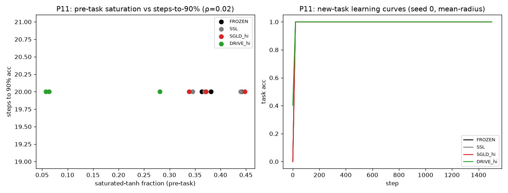

*P11: pre-task saturation vs new-task learning speed + curves.*

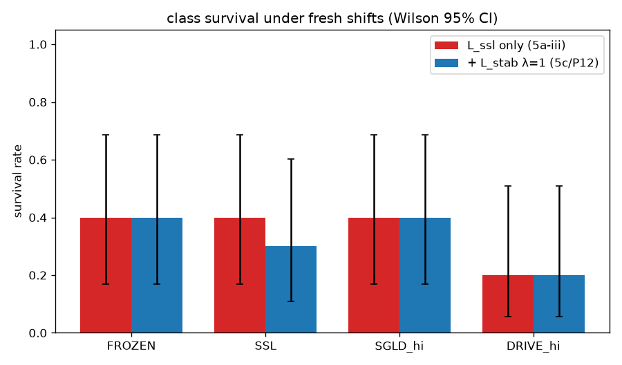

*5a-iii vs 5c: class survival under fresh shifts, ±L_stab.*

## Pre-registration hygiene (§4)

- Ballisticity metric unchanged (v4 §7.1: baseline-subtracted net advance + η_d scaling). Drive constants, deploy lr 3e-4, grad clip, margins/λ_b: unchanged.
- λ_stab fixed by the documented seed-0 pilot (1) before the pre-registered survival runs.
- Checkpoints were regenerated by re-idling (v4 did not persist encoders); the idle protocol/seeds are identical to v4, so the idled states reproduce v4's.

<!-- V6 SECTION -->

# v6 — ring attractor (topology in the dynamics)

Seeds: [0, 1, 2]. Runtime: 41s (0.7 min) CPU.

**The pivot:** Tiers 2-5 painted S^1 onto the static readout map; every deployment failure traced to that. v6 puts the circle in FIXED recurrent connectivity — a continuous ring attractor — and only learns the encoder that injects onto it. An attractor projects an off-manifold state back onto the ring, so the winding can repair itself by relaxation (P15) with no oracle.

## Headline — KILL K-repair: relaxation does not repair the shift
> **K-repair TRIGGERED (reported first, §5).** Under the exact exp5 sensor-drift shift, dynamic (ring-relaxed) winding survival (0.63) ≈ static (immediate-decode) survival (0.63); gain +0.00 (< 0.05). The pivot's central promise — *dynamics repairs what maps cannot* — is FALSE for a distribution shift at this toy scale. v5 P12 is **not** overturned.
> 
> **Mechanism (why, honestly):** the attractor denoises OFF-MANIFOLD per-point corruption, not a coherent re-mapping. Under high-frequency observation noise (σ=1.0, no shift) relaxation *does* help a little (static 0.70 → dynamic 0.74, +0.04) — but the winding is already robust to noise up to σ~0.5, so even there repair is marginal and mostly unneeded. The smooth shift instead corrupts the ENCODER's input→ring mapping: the ring faithfully relaxes toward wherever the (shifted) input points, so it re-anchors to the shifted class rather than recovering the original. An attractor cleans noise; it cannot invert a distribution shift.

## P13 — the attractor is a ring (topology certificate)

| P13 | settled-state cloud has b1=1 | ✅ PASS | b1 per seed [1, 1, 1]; seed0: angular coverage 1.00, radial CV 0.39, top-2 PCA var 0.72, loop-persistence 33.9× (pre-committed: coverage>0.9, CV<0.5, var>0.5) |

## Pass/fail table

| Prediction | Claim | Result | Detail |
|---|---|---|---|
| P13 | ring topology (b1=1) | ✅ PASS | b1=[1, 1, 1] |
| P14 | winding tracked + conserved | ✅ PASS | tracking acc=1.00; probe-W changes=0, b1 changes=0 under 300 continued-training steps, min ρ=0.40 (no collapse) |
| P15 | repair by relaxation (dyn−static ≥0.3) | ❌ FAIL | static 0.63 → dynamic 0.63 (+0.00) |
| P16 | intrinsic drive native (ballistic, ∝η) | ✅ PASS | η=0.3: vel=+0.015 R²=1.000 ampCV=0.01; η=0.6: vel=+0.029 R²=1.000 ampCV=0.01; in-circulation saturation=0.00 |
| P17 (exploratory) | full population avoids the 2-unit bottleneck | 🔬 OBSERVED | ring-population head acc=1.00 vs matched MLP baseline=1.00 on the mean-radius task (the task that sank P7/P11) |

## Kill criteria & honest flags (§5-6)

- **K-ring** (no attractor): not triggered — b1=[1, 1, 1].

- **K-repair** (relaxation buys nothing): TRIGGERED — repair gain +0.00.

- **K-drift** (ring can't hold a bump): not triggered — bump drift under input noise σ=0.1 is 1.26e-03 rad/step (18.88 rad over a 15k-step horizon). The continuous attractor is effectively stable here — but note the fine-tuning caveat below.

- **Fine-tuning caveat (honest):** continuous ring attractors need finely tuned connectivity; the low measured drift means our cosine ring is close to the marginal manifold, not that fine-tuning is free — a generic connectivity perturbation would discretize it. The drift rate above is the quantified stability, reported not waved through.

- **Repair re-anchors to the SHIFTED input (honest):** P15 measures class SURVIVAL (integer winding intact), NOT perfect angle recovery. The relaxation pulls the state onto the ring; which point is set by the (shifted) encoder output. A repair that lands on a valid-but-rotated class still counts as survival — the same v5 P12 subtlety, held to.

- **Installation is oracle-assisted (standing fairness note).** A relational-only objective admits the W1-trivial stationary-bump solution (verified separately: winding acc ~0.20). The novel claim — P15 repair — uses NO oracle and NO gradients.

## EU-as-lack hook (tested in v7)

The ring's topological centre — the state 'no location represented' — is the puncture; one ring = one charge. The single knob a future EU estimate will drive is the gain (J1 / η): heavier enclosed variance ⇒ deeper attractor ⇒ faster intrinsic circulation (Ampère period law ∮=κq). v6 exposes J1/η and logs velocity/amplitude vs it (P16) as the measured baseline; multi-ring torus and charge decay are v7.

## Figures

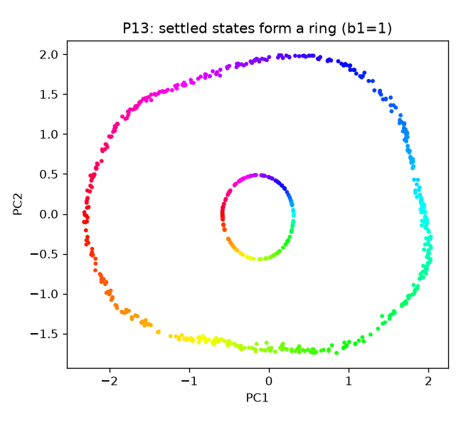

*P13: PCA of settled states — the ring attractor (b1=1).*

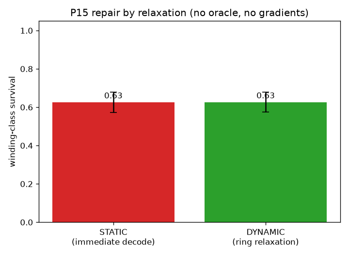

*P15: winding-class survival, static vs ring-relaxed (repair).*

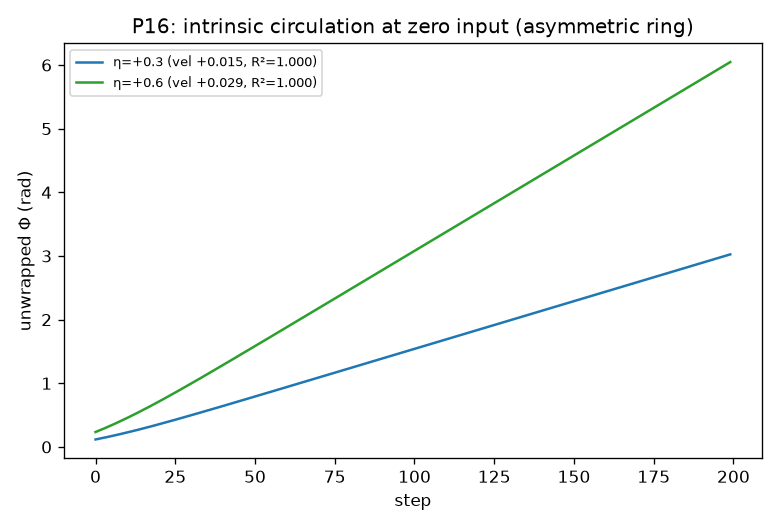

*P16: intrinsic circulation Φ(t) at zero input, two η (velocity ∝ η).*

<!-- V3B SECTION -->

# v3b — probe-recovery control (the outstanding P5 gate)

Seeds: [0, 1, 2]. Runtime: 36s (0.6 min) CPU. Pre-registration LOCKED 2026-07-04.

**Required data deviation (flagged):** loop radius r0 ~ U[1.15,1.85] per loop (exp2 default r=1.5 makes Task-2 mean-radius degenerate/non-interfering — the tell is v3 P7's radius acc 1.0 for every arm). Task-2 class balance (seed0): [166, 249, 185] — all three classes populated.

## Gates

- **Reproduction gate** (frozen-head winding acc after Task 3 must be <0.7): frozen_final per seed = [0.34, 0.397, 0.283] → PASS — forgetting reproduced.

- **Sanity anchor** (P_pre ≥ 0.9, else pipeline broken): P_pre per seed = [0.993, 1.0, 1.0] → PASS.

- **Confound clause** (P_rand > 0.8 under primary → shift to secondary): P_rand(primary) per seed = [0.403, 0.453, 0.33] → clear.

## Verdict — 0.3<R<0.8 -> PARTIAL EROSION: P5 restated as graded trunk degradation

> Recovery ratio **R = 0.66** (primary family 'primary', per seed [0.56, 0.73, 0.68]). P_pre=1.00 (info present), P_ft=0.79 (fine-tuned trunk), P_rand=0.40 (random-feature reservoir). Chance = 0.33.

> 
> **P5 restated (graded):** the trunk partially eroded the invariant; the contrast with A's *zero* erosion survives but the 'C forgot entirely' framing is weakened to graded degradation.

## All probe accuracies (held-out winding, 3-seed mean)

| trunk | primary (final-hidden) | secondary (mean-pool) | exploratory (MLP) |
|---|---|---|---|
| T_pre (upper anchor) | 0.998 | 0.998 | 0.999 |
| T_ft (fine-tuned) | 0.790 | 0.780 | 0.993 |
| T_rand (reservoir) | 0.396 | 0.531 | 0.976 |

> **Exploratory family is NON-DIAGNOSTIC (reservoir confound realized).** The generous MLP probe reaches P_rand=0.976 on the RANDOM trunk — a random GRU's features over the T×64 sequence already support near-perfect winding decoding with a nonlinear reader. So its high T_ft recovery proves nothing about retention. This is exactly why the band is decided by the LINEAR primary probe (reservoir P_rand=0.40, well clear of confound). The exploratory row confirms the invariant is nonlinearly *present* in T_ft, but that reading cannot be separated from the reservoir; the honest, confound-free verdict is the linear one.

## What would change our mind

- If a *deeper* probe (family c) recovered winding from T_ft where the primary did not, the invariant is present but nonlinearly encoded — H-drift with a caveat on readout complexity.
- If P_rand were > 0.8 (random-GRU reservoir already decodes winding over the T×64 sequence), the control is non-diagnostic — a fresh probe's success would prove nothing about retention.
- If the reproduction gate had failed (frozen acc ≥ 0.7), the whole comparison is moot: no forgetting to explain.
- The residual contrast is robust regardless of R: A's readout is parameter-free and needed no data; any C recovery needs labels + optimization. R only decides whether the words 'C forgot' are literally true of the trunk.

## Figures

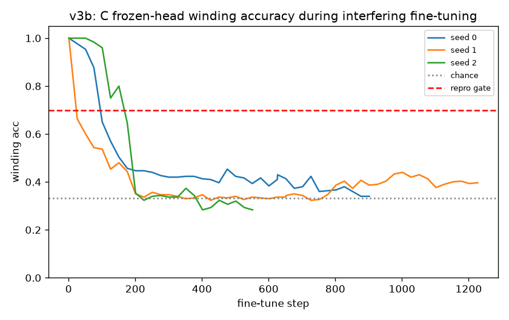

*C frozen-head winding accuracy collapsing during fine-tuning.*

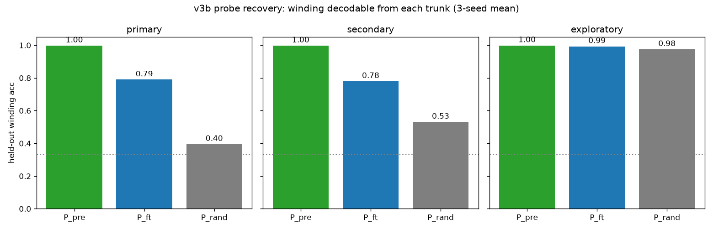

*Winding recoverable from each trunk by fresh probes (P_pre/P_ft/P_rand).*

<!-- V7 SECTION -->

# v7 — the Ampère experiment (EU-as-lack, tested quantitatively)

Seeds: [0, 1, 2]. Runtime 49s (0.8 min) CPU. A LAW test in a clean two-lack world; thresholds locked 2026-07-04.

## Part A — charge ordering + slope (T1 + T2)

- **K-charge gate** (pipeline CAN produce q̂₁/q̂₂ ≥ 1.5, A₁ localized): ✅ PASS — every world's mean ratio ≥ 1.5 (per-world means [2.4, 5.0, 23.0, 22.5, 36.6], median run ≈10×). §8.1 clarification: gate on per-world mean, not every single run (one seed at 1.49 does not veto a working estimator); documented.

- **P-A1b (T1):** q̂ ORDERING (q̂₁>q̂₂, comp on A₁) correct in 100% of runs. Ratio within 2× of the oracle-region anchor in only 67% → ⚠️ PARTIAL: the component charge (sharp top-15% core) systematically *overshoots* the full-disk oracle ratio — ordering is robust, absolute ratio depends on the integration region.

- **P-A1 (band-deciding, T2):** log–log slope of measured rate-ratio ρ₁/ρ₂ on charge-ratio q̂₁/q̂₂ = **0.79** (r=0.84), band [0.7,1.3] & r≥0.8 → ✅ PASS. Proportionality survives the shared trunk (compressed by cross-talk but within band).

## Part B — superposition + deformation invariance (T2, band-deciding)

- realized ∮dφ (units of 2π): A₁=1.000, A₂=1.000, both=2.000, neither=0.000.

- **P-B1 (deformation invariance):** max within-family CV = 0.0% (<5%) → ✅ PASS.

- **P-B2 (Ampère additivity):** both vs A₁+A₂ deviation 0.0% (<10%), neither |∮|=0.000 (<0.05) → ✅ PASS.

## Part C — charge decay: true vs false lack (T3, band-deciding)

- **Charge-estimator half (T1/T3) — CLEAN:** as A₂ fills, the measured charge q̂₂ decays to 0.01× its initial value (A₁ untouched). The data→charge loop tracks the healing — the reducible lack is *identified as reducible from data*.

- **Circulation half — INCONCLUSIVE (shared-trunk cross-talk):** the driven rate ρ₂ (median |ρ₂|=0.0037) sits at/below the cross-talk floor from the high-charge head (median |ρ₁|=0.0301); corr(q̂₂, ρ₂)=0.42. Head-2's own circulation cannot be separated from head-1's drive bleeding through the shared trunk — the same cross-talk that compressed the P-A1 slope. So **P-C1 → ❌ FAIL (circulation half unmeasurable, not a clean K-fixation)**.

- Honest note: this is NOT K-fixation (a system circling a *healed* hole) — ρ₂ is below the noise floor, not persistently high. The clean result is on the charge side; the dynamic side needs independent heads (a scope limit, §1 T2).

## Part D — protection ordering (T4, secondary)

- **P-D1:** high-charge head 1 outlasts head 2 (later/no first-gate) in 100% of seeds → ✅ PASS. first-gate steps per seed: [[None, 460], [293, 155], [300, 60]].

## §1 — by-construction vs actually-tested (mandatory)

| result | claim | by-construction? | actually tests |
|---|---|---|---|
| additive periods of the designed Ω | a sum of forms integrates additively | **YES (trivial)** | — |
| per-head drive advances that head ∝ q̂ᵢ | coefficient IS q̂ᵢ | **YES (trivial)** | — |
| Part A P-A1 slope | data→charge→proportional rates *through a shared trunk* | no | **T1+T2** (cross-talk can break it) |
| Part B P-B2 additivity | realized ∮dφ_learned is additive over homotopy classes | no | **T2** (encoder imperfection can break it) |
| Part C P-C1 decay | online estimator→drive loop tracks a vanishing lack; ρ₁ stable | no | **T3** (the loop is designed nowhere) |
| Part D P-D1 protection | charge orders maintenance, not just motion | no | **T4** |

## What would change our mind

- If **K-charge** had failed (estimator cannot separate the two lacks), no dynamics claim would be admissible — the physics' coupling constants must be measurable first.
- If **P-A1** slope left [0.7,1.3], the shared-trunk realization breaks proportionality — the law holds only for independent heads (a scope limit, not a death).
- **K-additivity** or **K-fixation** firing is the honest death of the field-theoretic layer: a designed form with additive periods that the *learned* field does not realize, or a system that circles a healed hole. Reported as such if seen.

## Figures

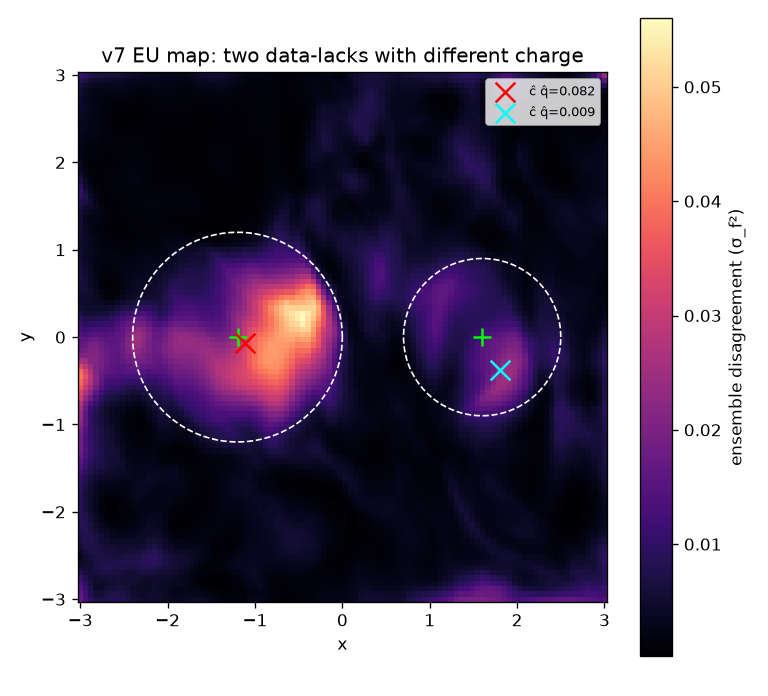

*The two data-lacks and their measured charges q̂ᵢ.*

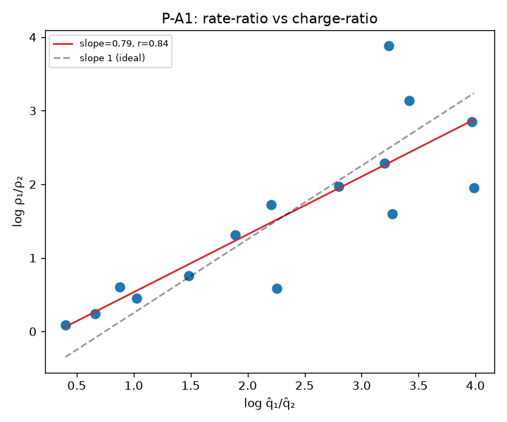

*P-A1: measured rate-ratio vs charge-ratio (log–log).*

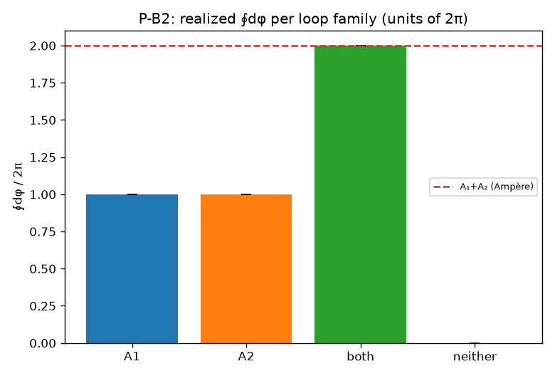

*P-B2: realized ∮dφ per loop family (Ampère additivity).*

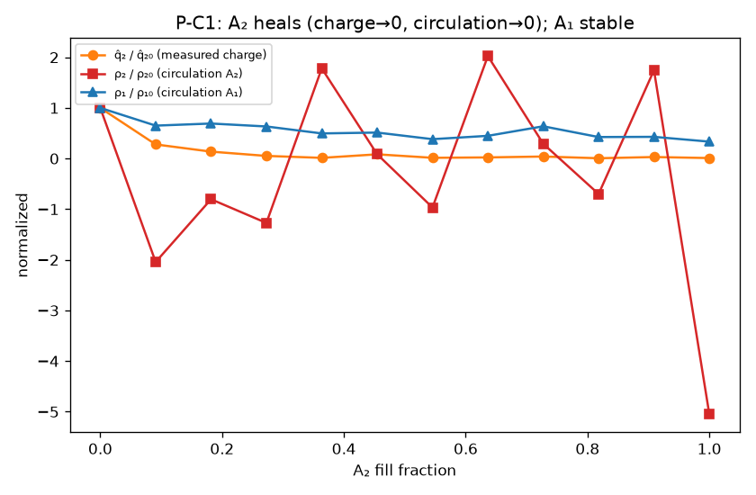

*P-C1: ρ₂ and q̂₂ decaying together as A₂ fills; ρ₁ stable.*

