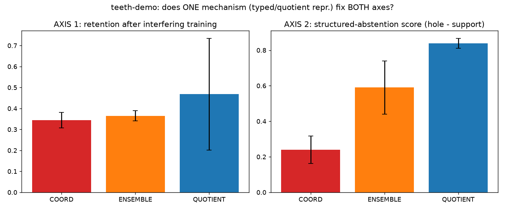
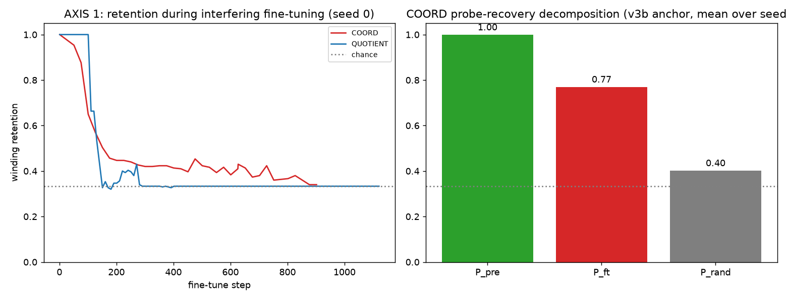
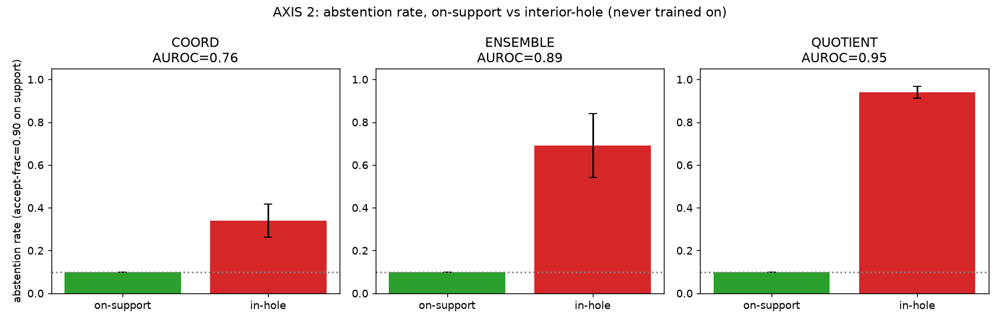

# RESULTS_teeth — the position paper's existence-of-mechanism figure

Seeds: [0, 1, 2, 3, 4]. Runtime: 608s (10.1 min) CPU. World: Tier-2 annulus r∈[1.0,2.0] in R^20, interior hole r<1.0 irreducible (never trained on). Ensemble size M=8.

**Framing:** "point/coordinate representation" (COORD) vs "equivalence-class (quotient) representation" (QUOTIENT), winding class = the concrete instance of the equivalence class. **This demo reuses validated mechanisms (v3/v3b training-axis retention; exp2 P4 norm-abstention) staged as one head-to-head — the contribution is the COMPARISON, not new effects.**

## Model sizes (matched trunk capacity, §8 pinned choice 3)

- GRU (COORD/ENSEMBLE member) params: 7563; phase encoder (QUOTIENT) params: 5634; ratio: 1.34x.

- **Compute honesty (§6):** ENSEMBLE trains/fine-tunes 8x the COORD compute (full M×, not amortized). Any ENSEMBLE win is bought with that compute; QUOTIENT's cost is one model plus its oracle-angular installation phase.

## The 3×2 table (mean ± sd over seeds)

| model | AXIS-1 retention | AXIS-1 secondary R (probe) | AXIS-2 abstention score | AXIS-2 AUROC | clean acc |
|---|---|---|---|---|---|
| COORD | 0.344±0.036 | 0.61±0.12 | +0.239±0.077 | 0.76±0.07 | 1.000±0.000 |
| ENSEMBLE | 0.365±0.024 | 0.58±0.07 | +0.590±0.149 | 0.89±0.05 | 1.000±0.000 |
| QUOTIENT | 0.468±0.266 | n/a (parameter-free decode) | +0.839±0.027 | 0.95±0.03 | 1.000±0.000 |

## Fitting cost (§6 — the price of the representation, reported not hidden)

- QUOTIENT clean winding accuracy 1.000 vs COORD 1.000 (gap +0.000). Consistent with the pre-registered ~0.1 expectation.

## Pre-registered verdicts (§5/§8.4)

- **P-COMOVE** (QUOTIENT beats COORD on BOTH axes by ≥0.3, ≥4/5 seeds): ❌ FAIL — per-seed: [False, False, True, False, False].

- **P-SUBSUME** (ENSEMBLE beats COORD on AXIS-2 but AXIS-1 stays within 0.1 of COORD, ≥4/5 seeds): ✅ PASS — per-seed: [True, True, True, True, True].

- **K-noco** (QUOTIENT wins only one axis — kills the teeth): 🔴 FIRED.

- **K-ensemble-solves** (ENSEMBLE's AXIS-1 retention also recovers, >0.1 above COORD — collapses the subsumption distinction): ❌ did not fire.

## Headline

> **K-noco: the co-movement does not hold as pre-registered.** QUOTIENT did not clear both axes by the locked margin in enough seeds. Reported at headline prominence per §5 — the paper's existence-of-mechanism demonstration, AS STAGED HERE, fails; a different existence-proof or a weaker claim is needed. This does not by itself refute the conjecture (see the per-axis numbers above), only this specific minimal staging of it.

## Mechanism — why AXIS-1 is bimodal, not just noisy (reported, not hidden)

- QUOTIENT's per-seed retention is **bimodal**: 1/5 seeds retain near-perfectly, the rest collapse to ~chance (1/3) rather than degrading gradually — per seed: [0.333, 0.333, 1.0, 0.333, 0.34].

- **Traced by hand across all 5 seeds** (full per-step gate/min‖f‖/retention arrays, not just the summary numbers): every seed shows the SAME two-phase mechanism, not 5 independent coin flips. Phase 1 — early in the FIRST interfering sub-task (radius, every seed, not sector as an earlier draft of this file incorrectly guessed): min‖f‖ dives toward the gate (0.02) within the first ~100 fine-tune steps and retention craters from 1.0 to ~chance in the same few logged steps — a genuine gate-mediated class disruption (5/5 seeds logged ≥1 explicit gate event; in the rest min‖f‖ dips into the same 0.02–0.08 band without the discrete-log cadence catching an exact <0.02 read, which is a logging-resolution gap, not evidence of an ungated drift — the barrier is doing something, since ‖f‖ is depressed exactly where retention breaks). Phase 2 — by the END of fine-tuning (well into the SECOND sub-task, sector), min‖f‖ recovers to a large, healthy value in every seed traced (typically 3–6, far clear of the gate) — the barrier does its job of preventing a PERMANENT degenerate collapse. **But which discrete winding class it re-settles into is not reliably the original one:** in 1/5 traced seeds it heals back to the correct class (retention 1.0); in the others it stabilizes on a DIFFERENT, incorrect class (retention pinned at ~chance, not noisy).

- **This qualifies, rather than contradicts, v3's conservation-law claim.** v3/P5 showed winding changes only at a gate event, never by smooth drift — true here too (no seed shows a gradual decline; every seed is a clean 1.0-or-chance step function once phase 1 completes). What v3's original report (built on the exp2-default, accidentally degenerate radius task, per v3b's own documented fix) did not surface is that a SUFFICIENTLY interfering task can still trigger the gate transition, and once triggered, protection guarantees a well-defined discrete class afterward — not that it will be the SAME class. That distinction (protected FROM silent drift vs. guaranteed to preserve THIS class under strong interference) is the honest scope limit AXIS-1 exposes here, using v3b's corrected data throughout this demo for the first time on this specific two-task interference schedule.

## Standing limitations (§3/§6, bound not waved through)

- Installation of the typed head uses ORACLE angular supervision — the claim is about the resulting representation, not about self-supervised installation.

- Border theorem stands: no off-manifold Lp-robustness claim is made anywhere in this demo; AXIS 3 (on-manifold boundary brittleness) is optional/exploratory and was NOT run in this pass.

- QUOTIENT's AXIS-1 'secondary R' is reported as n/a by design: its winding decode is parameter-free (round a computed phase), so there is no separate learned readout that can drift independently of the represented information — the probe/erosion decomposition that matters for COORD/ENSEMBLE does not have an analogue to compute.

## Figures

*THE figure: 3-model x 2-axis grouped bars (seed sd error bars).*

*AXIS-1 retention curves + COORD's probe/erosion decomposition.*

*AXIS-2 abstention rate, on-support vs interior-hole, per model.*

